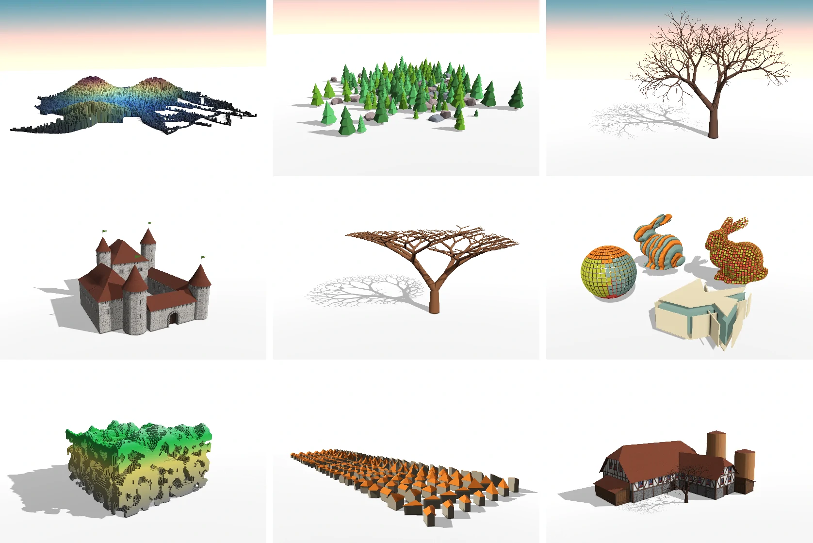
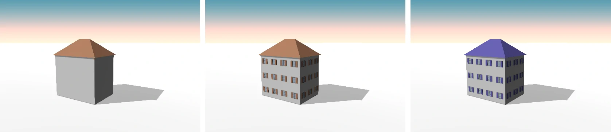

# Shape Modeling Language (ShapeML)

*ShapeML* is a rule- or grammar-based procedural modeling framework inspired by *Shape Grammars* [1], *L-Systems* [2], *CGA*/*CityEngine* [3], and *G<sup>2</sup>* [4].
Grammars written in ShapeML can generate detailed 3D models by iteratively replacing coarse parts of the model with more detailed components.
ShapeML comes with a parser/interpreter and with *ShapeMaker*, an interactive preview application to explore the resulting 3D models and to modify grammar parameters.
ShapeMaker uses a minimalistic but modern OpenGL renderer that supports forward/deferred rendering, rendering of transparency objects (via [weighted blended order-independent transparency](http://jcgt.org/published/0002/02/09/), a layered fragment buffer, or [adaptive transparency](https://software.intel.com/content/www/us/en/develop/articles/adaptive-transparency-hpg-2011.html)), several tone mapping methods, [sorted draw calls](http://realtimecollisiondetection.net/blog/?p=86), [optimized PCF cascade shadows maps](http://the-witness.net/news/2013/09/shadow-mapping-summary-part-1/), physically-based rendering (PBR), fast approximate anti-aliasing (FXAA), and [scalable ambient obscurance](https://casual-effects.com/research/McGuire2012SAO/index.html).

The following renderings showcase some 3D models created with ShapeML ([full resolution version](docs/showcase_large.webp)).



References:

- [1] *Stiny, 1975, Pictorial and Formal Aspects of Shape and Shape Grammars and Aesthetic Systems*
- [2] *Prusinkiewicz, Lindenmayer, 1990, The Algorithmic Beauty of Plants*
- [3] *Müller et al., 2006, Procedural Modeling of Buildings*
- [4] *Krecklau, Pavic, Kobbelt, 2010, Generalized Use of Non-Terminal Symbols for Procedural Modeling*


## Requirements

A Windows or Linux computer with an OpenGL 4.5 capable GPU and driver.
OSX is currently not supported (and it's unlikely to happen since Apple ditched OpenGL and since I don't have a Mac).
For Windows there is a binary release, on Linux you have build ShapeML yourself following the instructions further down.


## Getting Started or ShapeML Hello <del>World</del> House



This mini introduction assumes familiarity with L-systems or other parallel rewriting systems based on formal grammars.
`cd` into the directory where you stored or built ShapeMaker and create a text file called `hello_house.shp`:

```
const facade_color = "#dddddd";

param height = 10;             // Parameters, unlike constants, can be set by the
param roof_color = "#ad7859";  // user via cmd or modified interactively in the GUI.

rule Axiom = {
  size(8, 0, 11)  // Set the shape size to 8x11 m.
  quad            // Create geometry of a quad for the building lot.
  House           // Apply 'House' rule.
};

rule House = {
  extrude(height)           // Extrude the building lot up to 10 m.
  splitFace(                // Split the box mass model into faces.
    "top",      { Roof },   // Apply rule 'Roof' to the top face.
    "vertical", { Facade }  // Apply rule 'Facade' to all side faces.
  )
};

rule Roof = {
  color(roof_color) // Set color.
  roofHip(40, 0.5)  // Create geometry for a 40 degree 'hip' type roof with 0.5 m overhang.
  Roof_             // Create terminal shape with suffix _.
};

rule Facade = {
  color(facade_color)
  Facade_
};
```

Now run: `ShapeMaker.exe hello_house.shp` (or your Linux equivalent `./ShapeMaker hello_house.shp`).

Let's replace the dummy facade rule with something fancier:

```
rule Facade = {
  splitRepeatY(3, {    // Split the facade into stretchable floors of ~3 m each.
    splitRepeatX(3, {  // Split the floor into stretchable window tiles of ~3 m each.
      WindowTile
    })
  })
};

rule WindowTile = {
  color(facade_color)
  splitY("sfs",          // Vertically split the tile into 's'tretchable (proportionally
    1.0, { Wall_ },      // sized) 'Wall_' terminals and a 'fixed' sized row with 1.2 m height.
    1.2, {
      splitX("sfffs",    // Horizontally split the row into 'Wall_', 'Shutter', and 'Window' shapes.
        1.0, { Wall_ },
        0.4, { extrude(0.08) color(roof_color) Shutter_ },  // Abuse roof color for shutters.
        0.8, { Window },
        0.4, { extrude(0.08) color(roof_color) Shutter_ },
        1.0, { Wall_ }
      )
    },
    1.0, { Wall_ }
  )
};

rule Window = {
  [                   // Push current shape onto the stack.
    color("#aec3d8")
    roughness(0.1)    // Make the glass more glossy/relfective.
    Glass_
  ]                   // Pop material adjustments off the stack again.

  // Load OBJ mesh for window frame and grill. The asset path is relative to the grammar file.
  // The OBJ itself was generated with 'grammars/hello_house_window_frame.shp'.
  mesh("assets/hello_house_window_frame.obj")
  color(0.47, 0.47, 0.47)
  FrameAndGrill_
};

// Adding doors to the house is left as exercise to the reader.
```

Press the 'Reload grammar' button to see the updated facades.
You can play with the exposed height and color parameters and press the 'Derive' button to update the model (or activate 'Auto derive' to have interactive feedback).

The grammars for this example, for all the models in the teaser image, and more are available in the directory [grammars](grammars).
ShapeMaker can also export OBJ meshes and save screenshots, and it also has various command line options (run `ShapeMaker.exe --help` to see them all).


## Documentation

A complete list of all built-in shape operations, shape attributes, and functions is found in [docs/reference.md](docs/reference.md).

If you use vim to edit grammar files, consider using [vim-shapeml](https://github.com/stefalie/vim-shapeml) for syntax highlighting.


## License, Dependencies, and Credits

ShapeML is licensed under GPL3v3, see [LICENSE](LICENSE) file.

This project is shipped with some third-party dependencies, each of which may have independent licensing (see `external` directory):

- [eigen](http://eigen.tuxfamily.org)
- [glfw](https://github.com/glfw/glfw)
- [surface_mesh](https://opensource.cit-ec.de/projects/surface_mesh)
- [dear imgui](https://github.com/ocornut/imgui)
- [stb_image and stb_image_write](https://github.com/nothings/stb)
- [Roboto font](https://fonts.google.com/specimen/Roboto)

Some of the example grammars were adapted from or inspired by other projects or people.
Here are the credits:

- The Acacia tree grammar is ported from [*Talton et al., 2011, Metropolis Procedural Modeling*](http://vladlen.info/publications/metropolis-procedural-modeling).
- The Aono & Kuni L-system is taken out of the book [*Prusinkiewicz, Aristid Lindenmayer, 1990, The Algorithmic Beauty of Plants*](http://algorithmicbotany.org/papers/#abop) but the real credit goes to *Aono, Kuni, 1984, Botanical Tree Image Generation*.
- The Niklas & Kerchner L-system is out of *Eloy, 2011, Leonardo's Rule, Self-Similarity, and Wind-Induced Stresses in Trees* but has its origins in *Niklas, Kerchner, 1984, Paleobiology*.
- the Leopold L-system is inspired by *Leopold, 2017, Algorithmische Botanik durch Lindenmayer Systeme in Blender*.
- The color palette in most test sample scenes is from [Gruvbox](https://github.com/morhetz/gruvbox).
- The farm, castle, and Venice building grammars are ported from [*Lienhard et al., 2017, Design Transformations for Rule-based Procedural Modeling*](https://lgg.epfl.ch/publications/2017/Trafos/index.php). 
  I unfortunately don't remember the source anymore for some assets (brick walls, door, wooden planks, and roof tile textures used for the farm and castle; round door mesh used for the Venice house). Sorry.
- The gradient city example uses building footprints generated with and exported by CityEngine.
  The color palette is made with a technique from [Inigo Quilez](https://www.iquilezles.org/www/articles/palettes/palettes.htm).


## Building & Development

### Windows

You need Visual Studio and CMake.
The build has been tested with Visual Studio 2019 (16.8.3, platform toolset v142) and CMake 3.17.3.

Create project:

```bash
cmake -G "Visual Studio 16 2019" -A x64 -B build
```

Build project:

```bash
cmake --build build --config Release
```

Alternatively open `build\ShapeML.sln` with Visual Studio and build it in the IDE.
For debugging set `--config` to `Debug` (default value) or `RelWithDebInfo`.

Run:

```bash
build\Release\ShapeMaker.exe grammars\hello_house.shp
```

### Linux

You need GCC or Clang, and CMake.
The Linux build has been tested on Ubuntu 20.04 that comes with GCC 9.3 (`sudo apt-get install gcc cmake xorg-dev` was sufficient to setup the development environment).
Clang 10.0.0 can be used as an alternative for GCC.
The following instructions will hopefully work on other flavors of Linux too:

Create project:

```bash
cmake -B build
```

You can choose between debug and release versions with `-DCMAKE_BUILD_TYPE=Debug` or `-DCMAKE_BUILD_TYPE=Release`.
Release is default if not specified.
If you want to use clang, you either do `CXX=clang++ cmake ...` or export the variable before calling CMake: `export CXX=/usr/bin/clang++`.

Build project:

```bash
cmake --build build
```

Run:

```bash
./build/ShapeMaker grammars/hello_house.shp
```

### Tests

There are a few unit test for the grammar parser and the straight skeleton (but not for anything else unfortunately).
If you want to include the tests in your build, add `-DSHAPEML_TESTS=On` to the CMake options.
The unit tests currently only work on Linux, and you need [Google Test](https://code.google.com/p/googletest) in order to build them (`sudo apt-get install libgtest-dev`).
After compilation, all unit tests can be executed via:

```bash
cd build
ctest
```

Alternatively the tests can also be run with `make test` or by executing the individual test binaries.
Verbose output logs are found in `build/Testing/Temporary`.

There are three more standalone test executables that can be built by passing `-DSHAPEML_TESTS_STANDALONE=On` to CMake.
The intention is to show how to use ShapeML's interface for creating grammars and shape trees in code.
These standalone examples also work on Windows.

1. `interpreter_test_standalone.cc` programmatically creates a grammar for a row of simple buildings, runs it through the interpreter, and stores the output in a OBJ mesh file.
2. `shape_test_standalone.cc` programmatically creates the shapes and the shape tree for a very simple building.
3. `skeleton_test.cc` to debug and visualize the straight skeletons for a set of example polygons (the straight skeleton is required for roof generation).
   (On Linux this will require OpenGL development libraries, e.g., `sudo apt-get install libgl1-mesa-dev`.)

### Style Guide

ShapeML loosely adheres to the [Google C++ Style Guide](https://google.github.io/styleguide/cppguide.html). To check and validate the source code, this [fork of cpplint](https://github.com/cpplint/cpplint) can be used (the original one from Google won't work) with the following parameters and filters:

```bash
python cpplint.py --filter=-build/c++11,-readability/fn_size --exclude=PATH_TO_SHAPEML_REPO/src/viewer/gl/init.h --recursive PATH_TO_SHAPEML_REPO/src
```

The OpenGL binding file `src/viewer/gl/init.h` is excluded because most of its code is copy and pasted from `glcorearb.h` and would violate several of the cpplint rules.

There is a also [`.clang-format`](https://clang.llvm.org/docs/ClangFormat.html) file in the repository's root directory that allows for automatic formatting of the source code.


## Future Work & TODO

See [docs/todo.md](docs/todo.md).
